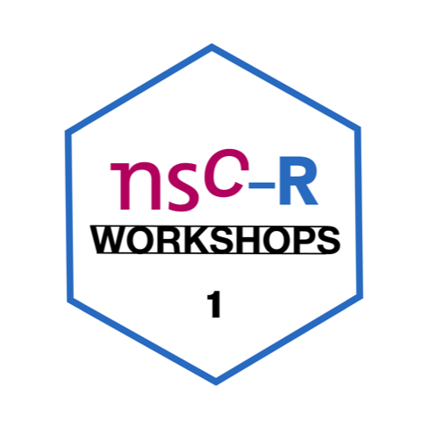

```{r setup, include=FALSE}
knitr::opts_chunk$set(echo = FALSE)
```

{width=50%}

On Thursday June 24, 13:00-14:00, we kicked off the NSC-R Workshop initiative. The topic of this first meeting was reproducibility, which is about how to organize your research workflow to create documented code and reproducible findings. The focus **was not on why** (we should know), but on practical guidelines **on how to do it**. It was presented by Thomas de Graaff. 

Here you find the [presentation](https://github.com/Jonkman1/NSC_R/tree/main/Meeting_1_Reproducibility/reproducibility.pdf)

To prepare for the first meeting, Thomas de Graaff suggested you might want to take a look at the following links. This is obviously not mandatory, but the materials may give rise to ideas or questions that you may want to discuss in the workshop meeting:   
- A very readable post on [reproducible workflow in R](https://cyberhelp.sesync.org/blog/reproducible-r-workflow.html).   
 
- A nice short blog post [about R projects](https://www.tidyverse.org/blog/2017/12/workflow-vs-script/).    
 
- If you are using R already and in particular if you use tidyverse, a long book-down document from about [style] (https://style.tidyverse.org/index.html).    
 
- A wonderful but distressing lecture (and long: about 50 minutes) from Richard McElreath about working with software in the social sciences, with a criminology paper example in the end on racial disparity in police use of deadly force.[find here](https://www.youtube.com/watch?v=zwRdO9_GGhY).

> Thomas de Graaf is associate professor at the department of Spatial Economics at the Vrije Universiteit in Amsterdam.
