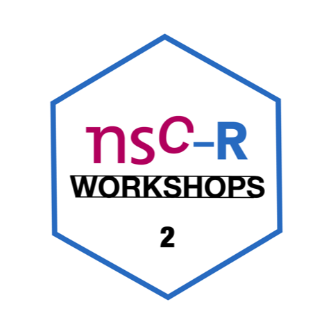

```{r setup, include=FALSE}
knitr::opts_chunk$set(echo = FALSE)
```


{width=50%}

**Markdown** is a language for producing formatted text with a simple text editor conceived with the idea of being human-readable from source. If you remember Thomas de Graaff's talk from two weeks ago, having human readable code is important for a number of reasons, such as being easy to debug, maintain, and extend. 

**RMarkdown** is simply a software that allows the implementation of this language in R. This makes it possible to produce open-access, fully reproducible documents.   

- To show you the basics, Asier followed the book [R Markdown: The Definitive Guide](https://bookdown.org/yihui/rmarkdown/) by Xie, Allaire and Grolemund. He recommends you read the Preface before the workshop. However, as a definitive guide, you can deduce that this book does not only cover the basics, so you can also use it to go deeper.   

- To have all the main commands at hand, you can print this double-sided [RMarkdown cheat sheet](https://www.rstudio.com/wp-content/uploads/2015/02/rmarkdown-cheatsheet.pdf). (We love cheat sheets.)   

- And for a quick overview of RMarkdown, just watch [this video](https://vimeo.com/178485416).


Here you find the [presentation, scripts and additional materials](https://github.com/Jonkman1/NSC_R/tree/main/Meeting_2_RMarkdown/nsc_r_workshop/scripts).

Here you find am [Elsevier template](https://github.com/Jonkman1/NSC_R/tree/main/Meeting_2_RMarkdown/nsc_r_workshop/templates/elsevier)

> Asier is a postdoc at the NSCR and The Hague University of Applied Sciences with a background in criminology. He started specializing in crime analysis with R during his master's degree and has since developed an interest in open science. 