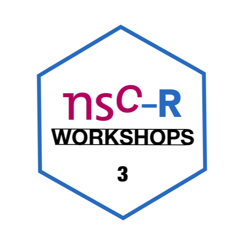

```{r setup, include=FALSE}
knitr::opts_chunk$set(echo = FALSE)
```

{width=50%}
   
The third meeting of the NSC-R Workshop was on Thursday September 2, 13:00-14:00 hr. Alex Trinidad introduced us to *spatial data* and how they can be processed in R. 
 
Learning to work with spatial data allows us to broaden our toolbox and our research horizons. In this workshop, we worked on the basic concepts of spatial data usage, data preparation, and basic visualisations. The aim was to introduce you to how to work with spatial data in R and provide materials that helped to go deeper into this type of data. 

To prepare for the meeting, Alex suggested you might want to take a look at the following links. This is obviously not mandatory, but the materials may give rise to ideas or questions that you may want to discuss in the workshop meeting:
 
- Lovelance, R., Nowosad, J., & Muenchow, J. [Geocomputation with R. CRC Press](https://geocompr.robinlovelace.net/).    
- [Bivand, R. S., Pebesba, E., & Gómez-Rubio, V.](https://link.springer.com/book/10.1007/978-1-4614-7618-4) Applied Spatial Data Analysis with R. Springer.(Access from university library)

[Scripts and data](https://github.com/Jonkman1/NSC_R/tree/main/Meeting_3_SpatialData) you can find here.


> Alex is a postdoctoral researcher at the NSCR and the University of the Basque Country UPV/EHU. His interest in spatial analysis began when he started his PhD, exploring the spatial distribution of juvenile delinquency and the contextual factors associated with it. It was also during his PhD that he began his journey with R. 
