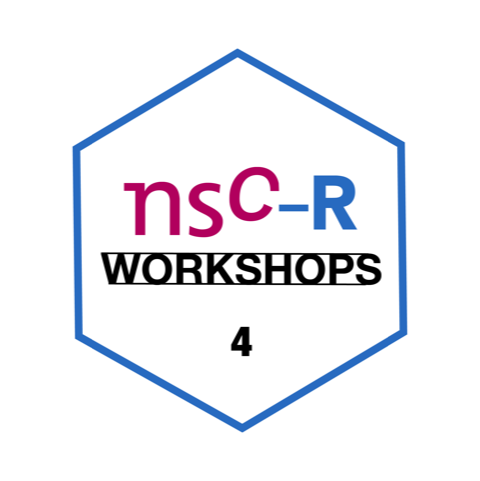

```{r setup, include=FALSE}
knitr::opts_chunk$set(echo = FALSE)
```

{width=50%}
This workshop session provides an introduction to **open data using R**. Following a brief introductory presentation (e.g. definitions, purpose) the bulk of the workshop will focus on practical examples which demonstrate how to obtain and handle open data within the R environment. 
 
No prior reading is necessary, but if you might want to skim through a [recent book chapter](https://osf.io/a96y7/) (in press) by Sam and Reka Solymosi on using open data in R to study the geography of crime. 


> Sam Langron is a postdoc researcher on the evidence-based policing programme at the NSCR. His research focuses on the spatial and temporal patterning of crime and police demand.

